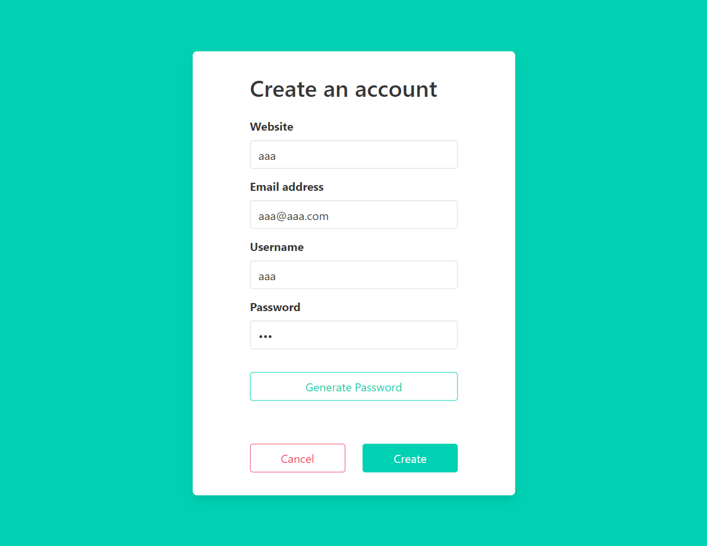

<!-- PROJECT LOGO -->
<br />
<p align="center">
    

  <h3 align="center">bluecrypt</h3>

  <p align="center">
    Password Manager
    <br />
</p>

<!-- TABLE OF CONTENTS -->

## Table of Contents

-   [About the Project](#about-the-project)
    -   [Built With](#built-with)
-   [Getting Started](#getting-started)
    -   [Prerequisites](#prerequisites)
    -   [Installation](#installation)
-   [Screenshots](#screenshots)
-   [Contributing](#contributing)
-   [License](#license)
-   [Contact](#contact)

## About The Project

This is a password manager. Store your accounts information into a crypted local file. Lock/unlock this file with a secret password.
Website : https://arsero.github.io/bluecrypt-page/

### Built with

-   [Electron](https://www.electronjs.org/)
-   [Electron-forge](https://github.com/electron-userland/electron-forge)
-   [Node](https://nodejs.org/en/about/)
-   [React](https://github.com/facebook/react)
-   [Typescript](https://www.typescriptlang.org/)
-   [Webpack](https://github.com/webpack/webpack)
-   [Bulma](https://bulma.io/)
-   [Best README Template](https://github.com/othneildrew/Best-README-Template)

<!-- GETTING STARTED -->

## Getting Started

To get a local copy up and running follow these next steps.

### Prerequisites

This project requires Node, yarn, git and [windows-build-tools](https://github.com/felixrieseberg/windows-build-tools) installed.

### Installation

1. Clone the repo

```sh
git clone https://github.com/Arsero/acryptex.git
```

2. Install NPM packages

```sh
yarn install
```

3. Start the application

```sh
yarn start
```

4. Build an installer (see the out folder)

```sh
yarn make
```

## Screenshots

### Login page

<p align="center">
    
</p>

### Main page

<p align="center">
    
</p>

### Add an account

<p align="center">
    
</p>

<!-- CONTRIBUTING -->

## Contributing

Contributions are what make the open source community such an amazing place to be learn, inspire, and create. Any contributions you make are **greatly appreciated**.

1. Fork the Project
2. Create your Feature Branch (`git checkout -b feature/your-feature`)
3. Commit your Changes (`git commit -m 'Add some your-feature'`)
4. Push to the Branch (`git push origin feature/your-feature`)
5. Open a Pull Request

## License

Distributed under the MIT License. See `LICENSE` for more information.

<!-- CONTACT -->

## Contact

[Arsero](https://github.com/Arsero) - azzedine.elb@outlook.com

Project Link: https://github.com/Arsero/bluecrypt

<!-- ACKNOWLEDGMENTS -->

## Acknowledgments

-   [HunteRoi](https://github.com/HunteRoi)
